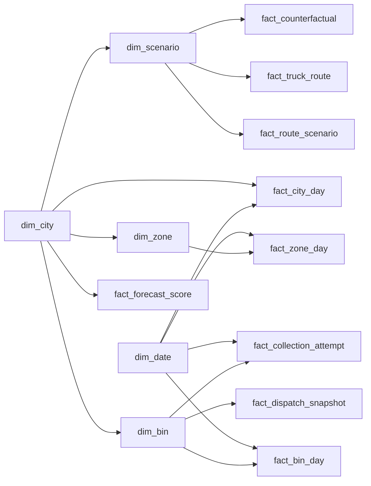

# Phase 5 Power BI model contract

> **30 September 2026 update:** Actual PBIX delivered and Desktop-tested. See [Desktop delivery](DESKTOP_DELIVERY.md). Original offline handoff below is historical; its no-PBIX status is superseded. Dedicated measure table is named `KPI Measures`.

The model serves the Chennai and Coimbatore **synthetic** operational scenarios. It uses two real but differently sourced ward datasets, hypothetical bin locations on OSM road nodes, and a single frozen route pilot per city. It is an import-ready star model, not an executed PBIX. Power BI Desktop was unavailable in this environment. Exact files are under `phase5_model/` and are regenerated by `python 06_python/scripts/build_phase5_bi.py` from the preserved two-city DuckDB.

## Grains and table roles

| Dimension | Grain and key | Business role |
|---|---|---|
| dim_city | one study city; city_id | Chennai/Coimbatore slicer; no current population claim |
| dim_date | one local 2026 date; service_date | historical operational date slicer |
| dim_zone | one city-qualified ward; zone_key | ward grouping and source/vintage labels |
| dim_bin | one hypothetical bin; bin_key | capacity, city-qualified ward label, map coordinates |
| dim_scenario | one city-specific route alternative; scenario_key | threshold, fleet size, feasibility and common-price caveat |

| Fact | Grain and key | Use and exclusions |
|---|---|---|
| fact_city_day | city × 2026 local date | city time series and **physical-overflow slots**; numerator/denominator retained |
| fact_bin_day | bin × 2026 local date | ward/bin fill, generated litres, overflow bin-days, hotspot map; fill numerator reconstructed from stored mean × received count |
| fact_zone_day | ward × 2026 local date | ward load and service pattern; same source activity as bin/city daily facts, never add totals across these grains |
| fact_collection_attempt | one simulated attempt; collection_key | completed, early (<35% true pre-service fill), late-risk attempt, collected mass |
| fact_dispatch_snapshot | one bin at 23 Sep 2026 issue; bin_key | required/forecast trigger/priority/access queue, independent of history date slicer |
| fact_route_scenario | city × scenario; scenario_key | matched fleet-level baseline and optimized distances; infeasible values are blank |
| fact_truck_route | city × scenario × method × vehicle; route_key | route-level km, stops and **reserved full-bin volume**; not an extra fleet trip count |
| fact_forecast_score | city × split × group × model | MAE/RMSE/recall from separately fitted models; no summing scores |
| fact_counterfactual | city × scenario | isolated 24 h modeled spill difference; not annualized |

Only import these 14 CSVs. Do **not** import `fact_bin_readings` (6.57M rows), the old `route_daily_metrics` formula proxies, or the duplicate `fact_vehicle_operations` projection into this model. City, bin, ward and scenario keys are namespaced; local IDs alone are unsafe joins. Optional raw event exploration stays in DuckDB.

## Relationship diagram

All arrows are active, single direction, one-to-many, with the dimension on the left. There are no bidirectional filters or fact-to-fact relationships.

The four city cascades are deliberate: `dim_city → dim_bin → bin/attempt/dispatch`, `dim_city → dim_zone → zone-day`, `dim_city → dim_scenario → routes/counterfactual`, plus direct city links to city-day and forecast scores. There is **no** `dim_zone → dim_bin` relationship because it would create an ambiguous city filter path. Use `dim_bin[ward_label]` to group bin/attempt facts; use `dim_zone[ward_label]` for ward-day facts. `fact_dispatch_snapshot` intentionally has no date relationship. Route scenario facts intentionally have no date relationship; one frozen dispatch date applies to every alternative.

Use data type **Text** for all keys and labels, **Date** for service_date/issue_date/target_date, **True/False** for flags, **Decimal Number** for measured values, and **Whole Number** for counts and ranks. Set `dim_date[service_date]` as the date table. Mark `dim_bin[latitude]` / `longitude` as Latitude / Longitude data categories. Hide technical keys from report view after verifying joins, keeping city and scenario fields visible for controls.

## Measure rules

The import-ready measure definitions and business denominators are in [PHASE5_MEASURES.dax](PHASE5_MEASURES.dax). Fill is a weighted mean from sum of fill percentage points divided by received readings. Physical overflow slot rate uses a truth-derived count divided by scheduled reading slots. The ward/bin `Overflow Bin-Day %` answers a different question and must retain its label. Completion includes `collected` and `partial` statuses. Early collection is a **retrospective simulation diagnostic**, not proof that service was unnecessary. Collection delay is omitted because no independent due timestamp or service-level deadline exists.

Route cards require one city and one scenario. The default is `base_3_trucks`. Alternative scenarios are counterfactual choices, so never sum their distance/fuel/cost as if separate realized trips. The cost measure is historical Chennai diesel price applied as a **common-price proxy** to both cities; it is not a verified Coimbatore procurement rate. `Reserved Truck Capacity %` is full-bin capacity reserved divided by 12,000 L per routed truck, not measured truck fill. Fuel economy (4.5 km/L), kg/L (0.12), depot, service time and fleet remain scenario assumptions. Forecast MAE is in **fill percentage points**; no cross-city mean of model MAEs is presented. The nominal 90% bands undercover, so the priority system does not claim calibrated probabilities.

## Reconciliation and limits

The builder's [QA receipt](phase5_model/qa_receipt.json) records 16 valid relationship paths and 52 city-specific KPI comparisons: DuckDB source SQL versus an independent Pandas calculation from the exported CSVs. All pass. [Full row-level KPI comparisons](phase5_model/kpi_reconciliation.csv) keep exact values and tolerances. The sum of attempt `collected_kg` and the preaggregated city-day collected mass differ by **0.37 kg in Chennai and 0.17 kg in Coimbatore** across the year because attempt masses were stored as rounded float32. The dashboard's collected tonnes uses the attempt fact consistently; use its total for QA. This is less than 0.000003% of each city's annual modeled collected mass.

No PBIX, Power BI service publish, cloud refresh or Power BI visual execution is claimed. The [manual build guide](PHASE5_BUILD_GUIDE.md) explains the exact remaining Desktop steps. The city-comparison scope is embedded in the Executive Overview page to keep the requested five-page layout. Operational comparisons describe different synthetic scenarios, including the assumed Coimbatore demand multiplier of 0.9; they are not real city performance rankings or significance tests.
