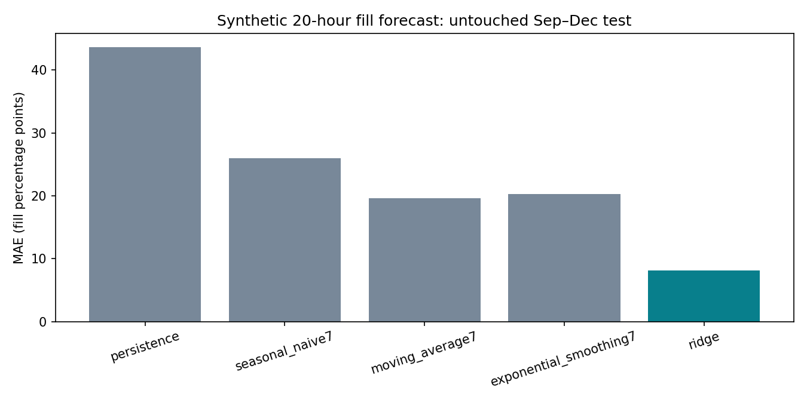

# Phase 4 — advanced analytics evidence report

Completed 2026-09-24. **Simulation demonstration; no realized Chennai savings.** Frozen dispatch: 23 September 2026 at 08:00 IST. Real OSM/GCC geography; hypothetical bins, fleet, facility and demand. Read the [methodology](../../docs/phase4_methodology.md) for assumptions and rerun commands.

## Decision and results
The model identifies 586 bins requiring attention among 1,000: 36 in the routing pilot, 545 outside its scope, and 5 requiring access review. It does not claim citywide collection coverage.

For the geographically selected 60-bin pilot, all 36 required bins are visited once by three trucks. Total road distance falls from **57.34 to 45.50 km**, a **20.66%** improvement against a feasible deterministic nearest-neighbor baseline with the same stops, capacities and shift limits. This is a bounded solver result, not proof of the global optimum and not a comparison with observed municipal routes.

Estimated vehicle time falls by **27.1 minutes**. At the explicit 4.5 km/L assumption, fuel savings are **2.63 L**. Historical retail-price savings are **INR 243.20** at Chennai IOCL diesel INR 92.39/L effective 1 March 2026 (S23); this is not a September procurement price. Tailpipe fossil-CO2 savings are **7.08 kg** using S24's US factor proxy. No wage, idling/PTO fuel, lifecycle emissions, annualized cash savings or realized benefit is asserted.

## Forecasting
The observed-only ridge regression was chosen on July–August validation, before September–December scoring. It predicts next-day 04:00 fill from information available at 08:00 today (20 hours), before the next scheduled 06:00 collection. Training uses January–June; the selected model is refitted through 31 August. Two hundred bins are held out from fitting and model selection.

Known-bin test MAE is **8.17 percentage points**, RMSE **11.04**, versus **19.65** MAE for the best simple baseline (seven-day average). Unseen-bin MAE is 8.19 points. MAPE is omitted because near-empty bins make it unstable; WAPE is included. Near-full recall is only 56.2%, so a low overall error does not establish a reliable overflow alarm.

The nominal 90% empirical interval covers **88.45%** of test observations, below nominal. It is a validation-residual risk band, not a calibrated overflow probability or guaranteed conformal interval. The refitted model can have different residuals; repeated bins, sensor noise and one synthetic year limit inference. Future policy changes require a new state-transition forecast. No future truth, annual summary or generator demand factor enters dispatch.

## Geography and accessibility
The derived network has 309,559 nodes and 651,742 directed edges. 992 of 1,000 bins snap within 100 m to its largest strongly connected component;8 do not. All 1,000 assigned ward IDs intersect their official polygons. EPSG32644 is used for local proximity calculations.

Among 1,507 mapped POIs, 51.8% lie within 250 m and 90.8% within 500 m of a hypothetical bin. These are straight-line OSM-POI proxies, not resident access or a municipal service-coverage estimate. Commercial proximity uses 827 mapped restaurant/market/shop nodes; residential proximity uses 1,025 closed OSM land-use ways. Missing mapped activity is not evidence of absent activity. Census 2011 ward numbers remain unjoined to current wards.

Interactive maps: [geospatial context](../maps/phase4_geospatial.html) and [baseline/optimized routes](../maps/phase4_routes.html). Toggle layers and inspect tooltips. Basemaps/CDN scripts require internet. The hotspot map is a retrospective full-year simulation and is not a dispatch feature.

## Priority and scenario tradeoffs
No weighted composite is used. Current-fill risk, missing/stale telemetry, long service gap and upper-forecast risk form documented lexicographic tiers. A bin meeting any rule is mandatory for this scenario; ranking never silently removes it from the VRP. Threshold 80%, gap 48 hours and stale 6 hours are policy assumptions, not empirically optimal or municipal mandates. A27-combination sensitivity grid covers 70/80/90% triggers,80/90/95% uncertainty bands and 36/48/72-hour gaps.

The base required load reserves each selected bin's full capacity:25,160 L. Thus one 12,000 L truck or two 24,000 L trucks cannot serve it in a single trip. This is conservative planning infeasibility, not proof that actual waste volume exceeds two trucks. Truck-unavailable inherits this constraint. Multi-trip unloading and smaller-risk-reserve policies are future extensions. At 70% the pilot requires 46 bins; at 90%,27; the+20% demand stress requires 48. Higher thresholds reduce work but leave more bins unserved; they are not a free efficiency gain.

## Overflow counterfactual
The isolated evaluator replays the same latent arrivals and initial inventories for all 60 pilot bins over 24 hours. Arrivals accrue uniformly within each two-hour interval; a visit removes 95% after four minutes. There are no other collections in the horizon. It recomputes inventory/spill and checks mass balance; it never reuses the unchanged baseline fill trace after an intervention.

Base optimized order reduces modelled spill by **11.06 L**. But the 70% trigger and+20% demand scenarios increase spill relative to their matched baseline order. Distance is the solver objective, not overflow or collected tonnes. Report terminal stock and collected volume alongside spill; earlier collection may remove less waste and allow later overflow. These outcomes do not establish avoided real overflow, comparative policy superiority or a sustainable daily schedule.

## Validation and readiness
All 31 pytest checks passed after implementing Phase 4, including every saved matrix path, exact required-bin coverage, no duplicate visits, depot returns, volume/payload/shift constraints, forecast availability, metric recomputation, factor equations and counterfactual mass balance. Original asset hashes remain checked. The final verification receipt records the rerun status.

**Share with caveats:** suitable for a portfolio simulation and review of methods. Deployment needs real inventory, observed histories, verified truck/depot/receiving-site access, local restrictions, service times, fuel calibration and monitored trials. Missing OSM restrictions cannot be tested into existence. No route-optimization significance test is performed on this one-date deterministic scenario. Power BI, cloud execution and final presentation remain outside this phase.

## Source evidence
- S09: preserved Geofabrik Southern Zone OSM2026-09-22 PBF, ©OpenStreetMap contributors, ODbL.
- S08: acquired official GCC ward GeoJSON; effective boundary date unverified.
- S23: [Lok Sabha Q3336,12March2026, Annexures I–II](https://sansad.in/getFile/loksabhaquestions/annex/187/AU3336_YCAaF0.pdf?source=pqals), PPAC historical Chennai diesel reference.
- S24: [US EPA diesel equivalency methodology](https://www.epa.gov/energy/greenhouse-gas-equivalencies-calculator-calculations-and-references),10,180 gCO2/USgallon, divided by 3.785411784 L/USgallon, rounded to 2.689 kg/L.
- [OR-Tools capacity constraints](https://developers.google.com/optimization/routing/cvrp) and [time dimensions](https://developers.google.com/optimization/routing/vrptw).
