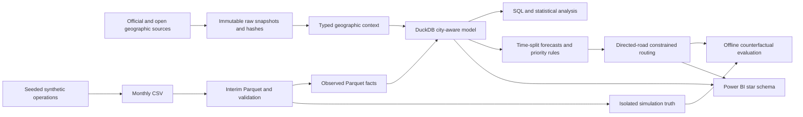

# Smart Waste Collection Intelligence & Route Optimization

An auditable analytics portfolio for **Chennai and Coimbatore, Tamil Nadu**: real geographic context, **6,570,000 explicitly synthetic sensor records**, SQL, statistics, forecasting, constrained routing and a five-page Power BI dashboard.

**Evidence boundary:** Synthetic operational data generated for scalability, analytics and optimization demonstration. No municipal sensor deployment, realized cost saving, production routing or executed cloud deployment is claimed. The hypothetical 2026 year includes future simulation dates. Start with [the 60-second recruiter summary](docs/RECRUITER_SUMMARY.md) or [the final report](FINAL_PROJECT_REPORT.md).

## Business Problem
Fixed collection schedules can send vehicles to partly empty bins while other bins overflow. The analytical question is which bins need service, how that demand may change, and how a constrained fleet can serve selected bins efficiently.

## Why It Matters
A useful system must connect data quality, service risk and route feasibility. Minimizing distance alone can worsen later overflow; the project explicitly measures that tradeoff instead of assuming every shorter route is better.

## Architecture

See [implemented model and units](docs/two_city_model.md), [ETL](docs/etl_phase2.md) and [source catalog](02_research/source_catalog.csv).

## Dataset
| Canonical entity | Rows | Origin |
|---|---:|---|
| Sensor readings | 6,570,000 | Synthetic; CHN 4,380,000 / CBE 2,190,000 |
| Bins | 1,500 | Hypothetical placement at real OSM nodes |
| Ward geometries | 300 | 200 GCC; 100 community-distributed OpenCity |
| Bin-days | 547,500 | Derived synthetic |
| Collection attempts | 322,675 | Synthetic, including missed attempts |
| City-days | 730 | Derived synthetic |
| Route scenarios | 18 | Hypothetical constrained experiments |

Thirty catalog references include 26 preserved assets across 24 source IDs. Used context includes GCC wards, Census 2011, OSM roads/POIs, NASA POWER 2025 weather, OpenCity Coimbatore wards and official CCMC references. Historical fuel/emission references support scenario factors. Not every downloaded webpage or PDF is a model input. [Acquisition manifest](02_research/acquisition_manifest.csv) records exact URLs, dates, hashes and source-use caveats. Census population is not joined to incompatible current ward IDs; weather is a historical proxy. Raw sources remain local because redistribution rights vary.

## Large-Scale Data Pipeline
Seeded Gamma arrivals, bin capacities, hourly/weekly/seasonal modulation, collection resets, missed/partial collections and sensor anomalies produce monthly CSVs. Conversion separates observed facts from latent truth. Canonical Parquet is partitioned by city/year/month; DuckDB reads it directly and creates small analytical marts. Duplicate physical snapshots are not counted as extra observations.

A recorded **372,000-row January benchmark** measured worker times of 0.936 s Pandas full CSV, 0.999 s chunked CSV, 0.280 s DuckDB CSV and 0.123 s DuckDB Parquet. This is one local run, not a robust platform benchmark; schemas differ for file-size comparisons. [Benchmark evidence](14_outputs/reports/large_data_benchmark.json). BigQuery Sandbox SQL is **prepared, not executed**; no billing enabled.

## SQL Analysis
[Fourteen Chennai business questions](05_sql/phase3_business_questions.sql) cover generation, fill speed, overflow, collection timing, weekday/hour/month patterns and reconciliation. [Eight city-aware queries](05_sql/city) support both cities and each city filter. CTEs, joins, CASE, HAVING, ranking, LAG/LEAD, rolling averages and percentiles answer operational questions. Early route/vehicle marts are formula proxies; network optimization uses separate tables.

## Statistics
Descriptive distribution, IQR/outlier and correlation analysis distinguishes sensor observations from latent generated waste. [Phase 3 report](14_outputs/reports/phase3_statistical_report.md) is a historical Chennai scope, not a city comparison or experiment on municipal residents.

## Hypothesis Testing
Two pre-specified weekend contrasts use 51 complete weekly blocks, HAC standard errors and Holm adjustment. Simulated weekend generated mass is 5,776.92 kg/day higher (95% CI 5,428.34–6,125.49); overflow-slot share is 1.450 percentage points higher (CI 1.355–1.544). Tiny p-values verify a programmed mechanism; they do **not** establish a real municipal weekend effect. Dependence, lag sensitivity and standardized effect sizes are recorded in [test results](07_statistics/hypothesis_tests.csv).

## Geospatial Analysis
Real ward polygons and OSM roads support bin placement, proximity proxies, access exceptions and directed road paths. Maps distinguish hypothetical bins from real geography. POI completeness, boundary vintage, omitted restrictions and last-metre access require field verification. No population-weighted access or real bin coverage claim is made.

## Forecasting
Predict next-day 04:00 fill from an 08:00 issue time (20-hour horizon). Train January–June, select July–August, test September–December. Compare persistence, seasonal naive, moving average, exponential smoothing and Ridge. Fit imputation inside the training pipeline; exclude future labels and latent truth.

Known-bin test MAE: **8.17 pp CHN / 7.69 pp CBE**, versus seven-day moving-average **19.65 / 20.57 pp**. Near-full recall is only **56.18% / 57.97%**. Nominal 90% interval coverage is **88.45% / 88.22%**; uncertainty bands are empirical, not calibrated overflow probabilities. [Methodology](docs/phase4_methodology.md).

## Route Optimization
OR-Tools solves mandatory-stop, directed-road vehicle routing with volume, assumed payload and eight-hour shifts, depot return and unloading. Each city uses a 60-bin geographic pilot on 23 September 2026, with 36 CHN / 34 CBE bins requiring service in the base case. A matched nearest-neighbor baseline uses the same required stops and constraints. Five-second search does not prove global optimality.

## Dashboard
An actual local `12_powerbi/Smart_Waste_Chennai_Coimbatore.pbix` contains five pages: Executive Overview, Waste & Bin Analysis, Geographic Intelligence, Route Optimization, Forecasting & Planning. It uses 5 dimensions, 9 facts, 16 relationships and 35 DAX measures. Desktop rendering and 52 DAX reconciliations were verified in the delivery phase; archive integrity was rechecked during audit. No Power BI Service publication or scheduled refresh occurred.

The PBIX and data extracts are excluded from source Git history. [PBIP report/model definitions](12_powerbi/desktop_project), [DAX](12_powerbi/PHASE5_MEASURES.dax), [build instructions](12_powerbi/PHASE5_BUILD_GUIDE.md) and [delivery evidence](12_powerbi/DESKTOP_DELIVERY.md) remain reviewable. Refresh paths must be changed after relocation. Exhaustive filter combinations and narrow-window rendering were not verified.

## Key Findings
- Demand and overflow patterns reflect explicit simulator mechanisms, useful for demonstrating QA and analysis rather than estimating city effects.
- Forecast accuracy improves over simple baselines, but limited near-full recall supports conservative service rules and operator review.
- Shorter routes do not universally reduce spill: negative counterfactual outcomes are retained.
- Raw city totals are not an efficiency ranking: bin counts, seeds, boundaries and Coimbatore's assumed 0.9 demand multiplier differ.

## Business Impact
| Matched synthetic pilot | Chennai | Coimbatore |
|---|---:|---:|
| Baseline km | 57.34 | 38.46 |
| Optimized km | 45.50 | 27.97 |
| Distance saved km | 11.85 | 10.48 |
| Reduction | 20.66% | 27.26% |
| Assumed fuel saved L | 2.63 | 2.33 |
| Historical-price fuel saving INR | 243.20 | 215.22 |

Fuel uses assumed 4.5 km/L; both cities use historical Chennai INR92.39/L as a common proxy. These are one-scenario estimates, not realized or annualized savings. Management should validate bin locations and truck access, run a measured shadow pilot, monitor missed overflows, and compare distance **and** service outcomes before changing operations.

## Tech Stack
Actually executed: Python, Pandas, NumPy, PyArrow/Parquet, DuckDB/SQL, SciPy, scikit-learn, Shapely, PyProj, NetworkX, osmium, Folium, Matplotlib, OR-Tools, pytest, Excel QA workbook and Power BI Desktop/DAX. Git packages the sources. BigQuery is documentation only. GeoPandas/OSMnx are not claimed merely because early plans listed them.

## Testing
Final suite: **43 tests passed**, including four new acquisition safety regressions. [Final audit evidence](14_outputs/reports/final_audit/audit_receipt.json) records exact row counts, origins, keys, raw hashes, partition pruning and PBIX integrity. Foundation: 13 checks. SQL: 14 + 24 city/filter executions. BI: 52 SQL/Python checks and 16 relationships. Historical Desktop: 52/52 DAX checks. Final test count is recorded in [audit report](docs/FINAL_AUDIT.md).

## Limitations
This is a portfolio simulation, not a production municipal system. Real telemetry, GPS, depot/fleet constraints, current comparable demographics and contracted costs are unavailable. Statistics assess one synthetic realization. Forecast bands undercover. Road access is provisional; routing reserves full bin volume and allows one trip. Counterfactuals isolate 24 hours without other routine collections. Clean-machine regeneration and live cloud execution remain unverified. Notebooks have runnable script companions but no saved executed cell outputs.

## Reproduction Instructions
Follow [the ordered reproduction guide](docs/REPRODUCTION.md). Existing-data audit avoids regeneration. A fresh clone requires acquiring licensed source snapshots and generating local data before integration tests; downloads may change or become unavailable. Do not run historical documentation finalizers over the final handover.

## Repository Structure
Numbered folders separate business/research, local data, Excel, SQL/Python, statistics, geography, forecasting, optimization, cloud instructions, Power BI, testing and evidence. `cities/CBE` holds the isolated second-city workspace. `config` records assumptions. `docs` contains contracts, methodology, audit, recruiter/interview material and reproducibility notes. Large data, caches, installers and binaries remain ignored locally.
