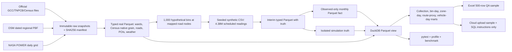
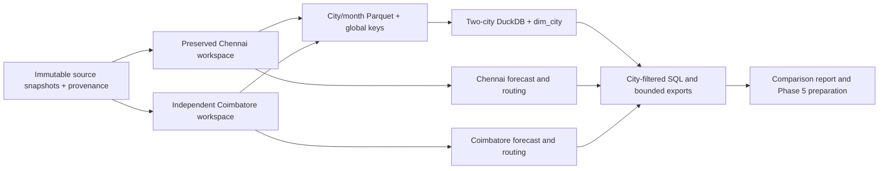

> Final-audit status (2026-09-30): an actual five-page PBIX has been delivered. Earlier phase-status statements below are historical. Current entry points are README.md, FINAL_PROJECT_REPORT.md and docs/REPRODUCTION.md. Do not run historical finalizers over the final handover.

# Phase 2 implemented architecture

Operational scenario rows, bin installations, collection attempts, route-distance proxies and fuel proxies are synthetic or assumptions. Real OSM coordinates are anchors for hypothetical bins. Native 2011 Census data are stored separately from 2026 GCC ward polygons; there is no unverified geographic crosswalk. Weather is a separate 2025 grid-point reference, not a future realized feature. The regional OSM PBF is preserved untouched; extracted Chennai road segments are a spatial foundation, not a truck-safe routing network.

The fact table is a persistent DuckDB view over monthly Parquet, so the 4.38M rows are queried rather than duplicated inside the database. Smaller marts are materialized. The sample workbook and cloud CSV have synthetic origin labels. Every raw asset is in `02_research/acquisition_manifest.csv` with a SHA256 hash; source IDs map to `02_research/source_catalog.csv`.

## Phase 4 implemented extension

See [Phase 4 architecture and contracts](phase4_methodology.md). A newly derived directed OSM graph supports a 61-location road matrix. Observed-only facts feed time-split forecasts and priorities; a separate truth evaluator consumes routes after optimization. Raw assets and previous marts are preserved. New route outputs replace no historical proxy table and are scenario-keyed.

## Two-city expansion — 25 September 2026

The original Chennai workspace/database is retained. Shared Python engines select `SMART_WASTE_CITY`; Coimbatore runs in `cities/CBE/`. The new canonical database is `03_data/processed/two_city/two_city.duckdb`. `dim_city` filters city-specific facts and dimensions; namespaced keys prevent local-ID collisions. Actual grains, unit conventions and relationships are in `two_city_model.md` and `data_dictionary_two_city.csv`.

There is no intercity route and no pooled forecast. Latent truth remains evaluation-only. Canonical Parquet is a city-enriched materialization, not additional observations. Legacy route proxies and road-network scenario routes remain separate fact domains.

## Phase 5 — business intelligence

Power BI import surface: `12_powerbi/phase5_model/` holds five dimensions and nine facts exported from `two_city.duckdb`. City filters cascade through bin, zone and scenario dimensions without multiple active paths; shared date filters only historical daily/attempt facts. Forecast scores are city/model evaluations and dispatch/route alternatives use fixed snapshots, so neither follows the historical date slicer. `12_powerbi/PHASE5_MODEL.md` contains the implemented Mermaid graph and grain table. No Power BI Desktop artifact or service model was executed.
