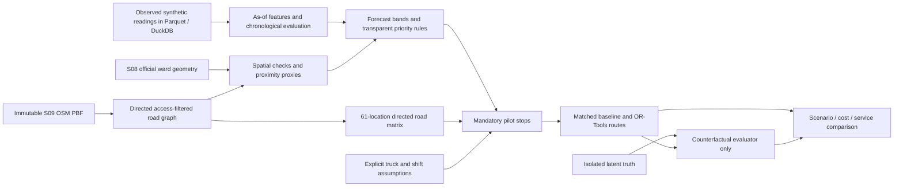

# Phase 4 methodology and reproducibility

This phase continues the existing Tamil Nadu / Chennai simulation. It does not replace the Phase 2 source bundle or claim real bin telemetry. The decision snapshot is fixed at **2026-09-23 08:00 IST**, not a live dispatch recommendation. Outputs were completed on 2026-09-24.

## Evidence and architecture



Origin rules: geography is real/official; graph distances and spatial features are derived; bin placement and operations are synthetic; truck/depot/speed/service assumptions remain assumptions; fuel price is an official historical reference used as a proxy; EPA emissions are a US factor used as an explicit proxy. `data_origin=synthetic` on analytical operational outputs describes their underlying observations, not a claim that road geometry is fabricated. `distance_origin`, `time_origin`, source IDs and this contract preserve mixed lineage. Latent truth is never passed to forecast fitting, priority rules or route search.

## A. Directed network and coverage

`phase4_extract_roads.py` reads the untouched 2026-09-22 regional PBF using pyosmium. It retains drivable highway classes inside the expanded bounding box in `config/phase4.json`, computes geodesic segment lengths and preserves one-way direction (including reverse one-way and default roundabout/motorway direction). Duplicate directed node pairs retain the shortest segment. Prohibited/private motor access is excluded. Numeric maxweight/maxheight/maxwidth restrictions are compared with the assumed 12-tonne gross, 3.5-metre-high, 2.5-metre-wide truck; unparsed restrictions and conditional access are excluded.

Applicable turn restrictions are handled conservatively by removing via nodes, or member ways for via-way restrictions. Barriers without explicit motor access are excluded. This sacrifices connectivity rather than implementing a full turn-state graph. OSM `except` tags for applicable vehicles are honored. Missing tags, city rules, lane width, axle limits, gradients, flood closures and undocumented restrictions remain unknown: **this is not a certified truck-safe network**. Positive tagged maximum speeds cap assumed class speeds; traffic and stops at signals are not observed.

`phase4_geospatial.py` uses the largest strongly connected component. Bins snap to its closest node in EPSG:32644; greater than 100 metres is an access exception. The last offset to the physical hypothetical bin is not a driven road segment: it is assumed handled within four-minute service time and requires field verification. A bin coinciding with a mapped node does not prove curbside stopping is legal.

The pilot is the 60 geographically nearest accessible bins to fixed coordinates 13.0827, 80.2707. Selection precedes examining their fill or outcomes; this is a compact demonstration, not a representative sample of Chennai. The hypothetical depot/receiving site is the eligible road node nearest those coordinates. It is not identified as an actual transfer facility. Every route returns there; final unloading takes 15 assumed minutes.

SciPy directed Dijkstra creates all 61×61 distances, predecessors and travel times. Travel time is summed along the **same shortest-distance path**, not a separately fastest path. Every saved path is independently reconciled against the edge table. The matrix is asymmetric. The geospatial map combines all 1,000 bins' retrospective simulation overflow with real ward boundaries; those annual outcomes do not enter dispatch.

Commercial proximity uses mapped restaurant, marketplace, supermarket and convenience POIs. Residential proximity uses closed land-use ways only; multipolygon relations are omitted. Projected straight-line buffers and nearest-bin distances are coverage proxies. No population-weighted access denominator, address walking path or real collection coverage is available. Native Census 2011 wards are not joined by number to current GCC wards.

## B. Forecast contract

- Target: observed fill percentage at next-day 04:00 IST, 20 hours after issue time, before the synthetic policy's next 06:00 collection. Clipped sensor fill cannot measure litres of physical overflow.
- Features: latest good same-day reading up to 08:00, good 04:00/06:00 readings, seven-day mean and exponentially weighted 04:00 history, same-weekday observation seven days before target, historical overnight growth, recent 06:00–08:00 growth proxy, time since service, sensor age, bin capacity and known target weekday. Growth computed with a stale latest reading remains a proxy; sensor age is included, and >6-hour stale sensors trigger review.
- No bin/zone ID, full-year outcome, generator demand factor, future weather, target-day truth or future collection enters model features. Missing features are median-imputed **inside the fitted pipeline**. Missing target observations are excluded, never imputed. Baseline fallback is historical average, then current fill, then neutral 50%; its use is explicit in code.
- Training target dates end 30 June. July–August validation chooses the model. Ridge with a fixed alpha of 10 is accepted only if validation MAE beats the best simple baseline by at least 2%. The final fit includes target dates through 31 August. Test target dates are 1 September–31 December. There is no random row split or test-driven hyperparameter search.
- The 200 bins with `bin_id % 5 == 0` are excluded from model fitting, selection and interval calibration. Their own past readings are still legitimate inference features. This tests transfer to unseen bin identities, not transfer to an unseen contiguous geography.
- Baselines: persistence, seasonal-naive seven days, seven-day moving mean and span-seven exponential smoothing. Ridge is justified by validation gain. Holt-Winters is not fitted to a clipped, collection-reset series solely for complexity.
- MAE/RMSE use percentage points; WAPE uses total absolute error divided by total observed target fill, not average individual percentage errors. MAPE is excluded for near-zero targets. Near-full recall is reported at 95%, alongside continuous error.
- Absolute validation residual quantiles provide 80/90/95% empirical bands, clipped to [0,100]. Calibration uses the pre-refit selected model; final-model coverage is separately measured and is below nominal at 90%. These dependent repeated-bin residuals are not exchangeable; no formal conformal guarantee or overflow probability is claimed. Monthly held-out metrics expose variation without retuning.

The future portion of the hypothetical synthetic year is an evaluation fixture, not observations collected ahead of the actual date. Dispatch never reads future labels. Once collection policy changes, baseline-policy fill forecasts are not counterfactual predictions of the changed policy.

## C. Priority rules and sensitivity

At each issue, a bin is required if any of these hold: current fill ≥ trigger; forecast upper band ≥ trigger; service gap ≥ maximum (or unknown); telemetry >6 hours old or missing. Default trigger is 80%, band 90%, gap 48 hours. These operational guardrails are explicit scenario assumptions requiring stakeholder calibration.

There is no arbitrary weighted sum. Lexicographic tiers are current-fill risk, telemetry uncertainty, long gap, then forecast risk. Within tiers sort descending upper risk, current fill and gap, then ascending bin ID as deterministic tie-break. The order aids an operator; the routing solver still must visit every required pilot bin. Accessibility is a separate exception, never a numerical penalty hiding a bin. Required bins outside the 60-bin pilot remain visible and unserved by this local routing experiment. No unsupported zone-importance weight is assigned.

The sensitivity file evaluates 3 triggers × 3 uncertainty bands × 3 service gaps = 27 combinations. Gap settings can have identical outcomes on this post-morning-collection snapshot; that is evidence about this date, not proof gap policy never matters. Demand +20% multiplies the forecast increment above current fill, bounded at 100%; it is a conservative stress rule, not a newly evaluated forecast model. In its counterfactual evaluator, actual simulated arrivals are also multiplied by 1.2.

## D. Routing model and baseline

Use identical required stops and road matrices for baseline and optimization. The baseline is deterministic nearest-neighbor insertion into each truck until the next feasible stop cannot be added, then the next truck. It includes complete return and unload time when checking additions. It is a transparent heuristic comparison, not an acquired municipal fixed route or an intentionally omitted return journey.

Each truck has assumed 12,000 L volume and 5,000 kg payload. Demand reserves the **full bin capacity**, with 0.12 kg/L density, so future accumulation cannot exceed the volume allowance. This can overstate truck needs. Gross road restriction mass (12 tonnes) is separate from payload capacity. There is one trip per vehicle, no free intermediate unloading or capacity resets. Four minutes per bin, 15 minutes final unloading, maximum eight hours per truck. Total vehicle-hours are the sum across vehicles, not wall-clock time until the last truck returns.

OR-Tools uses integer ceil-metres for arc cost, integer ceil-seconds for road travel, separate volume and gram payload dimensions and a shift dimension. No disjunction permits silently dropping required stops. A complete baseline seeds the search; otherwise parallel cheapest insertion initializes it. Guided local search runs for five seconds. Global optimality is not claimed; solution details are preserved. Wall-clock limits can change results on rerun/hardware. Independent validation uses original floating road distances/times, exact selected stops and load sums.

Total reserved demand exceeding fleet capacity is a mathematical infeasibility certificate for this **single-trip reserve model**. Search failure without such a certificate is reported separately as no solution found, not proven infeasible. One/two/three-truck, 70/80/90% trigger, demand +20%, one unavailable truck, and fuel-price ±20% scenarios are saved. Unavailable-truck and two-truck cases intentionally share constraints. Fuel-only scenarios reuse the same routes.

## E. Impact and counterfactual limits

Distance saved = matched baseline km − optimized km. Percent reduction divides by baseline km. Fuel saved = distance saved / assumed 4.5 km/L; sensitivity uses 3, 4.5 and 6 km/L. Cost = fuel × INR 92.39/L × scenario price multiplier. This historical IOCL Chennai reference is effective 1 March 2026, from the 12 March Lok Sabha response/PPAC (S23), not a current or contracted rate. Fossil tailpipe CO2 = fuel × 2.689 kg/L, rounded from EPA 10.180 kg/US gallon ÷ 3.785411784 L/US gallon (S24). No unsupported wage cash savings, lifecycle impact or diesel-engine idling/PTO fuel is included.

`phase4_counterfactual.py` is deliberately isolated from forecast/priority/search. It starts with simulation truth at issue time and the subsequent twelve two-hour arrival increments for all 60 pilot bins. It linearly spreads each increment over its interval, removes 95% at the end of a selected bin's service, recomputes capacity spill and terminal stock, and checks conservation: initial + arrivals = removed + spill + terminal. There are **no additional routine collections in the 24-hour evaluation horizon**. This isolates dispatch order; it does not evaluate a sustainable weekly policy. Future routine fleet work would need explicit modelling.

Earlier collection may remove less waste and worsen later overflow; the solver minimizes distance, not overflow. Negative `overflow_l_avoided_modelled` is retained. Report all 60 bins' spill and terminal inventory, not only serviced bins. There is no statistical significance claim from one deterministic planning date and one synthetic seed. Real deployment would require repeated matched-demand days and out-of-sample policy simulations/trials.

## Output grains and keys

| Output | Grain / key | Meaning and units |
|---|---|---|
| `directed_edges.parquet` | directed `(u,v)` road node pair | length_m; assumed travel_seconds; source S09; derived geometry |
| `road_nodes.parquet` | `osm_node_id` | WGS84 longitude/latitude |
| `bin_spatial_features` | `bin_id` | one-to-one Phase 2 bin; metres for proximity/snap; accessibility and pilot flags |
| `matrix_locations.csv` | `matrix_index` | depot=0, 60 unique bin IDs; routing OSM node FK; node need not uniquely identify a bin |
| `road_matrix.npz` | origin/destination matrix index | directed metres and assumed seconds |
| `dispatch_forecasts` | `(bin_id, issue_time_utc)` | synthetic origin; 20-hour prediction and upper bounds in fill percentage points |
| `test_predictions.parquet` | `(bin_id, target_time_utc)` | held-out observed label/prediction; test-only, not input to dispatch |
| `forecast_evaluation.csv` | `(split,group,model)` | n; MAE/RMSE percentage points; WAPE percent; recall fraction |
| `collection_priority.csv` | `bin_id` for frozen issue | unique rank, boolean rule flags, reason/status; one-to-one dispatch forecast |
| `priority_sensitivity.csv` | `(trigger_pct,interval_level,max_gap_hours)` | 27 combinations, counts and reserved litres |
| `scenario_comparison.csv` | `scenario` | fleet-level km/hours/fuel/cost/CO2; infeasible savings NULL, not zero |
| `route_summary.csv` | `(scenario,method,vehicle)` | truck-trip distance metres, travel/duration seconds, reserved load litres/kg |
| `route_stops.csv` | `(scenario,method,vehicle,stop_sequence)` | includes both depot endpoints; arrival minutes after 08:00; departure = arrival + service; final unloading is in route duration |
| `counterfactual_bin_results.csv` | `(scenario,method,bin_id)` | initial/arrivals/terminal/spill/removed litres, selected visit count |

The generated `data_dictionary_phase4.csv` inventories every exported field/dtype/unit. This contract supplies table meaning and joins. `source_catalog.csv` now contains 24 sources and the immutable acquisition manifest contains 20 assets; S23/S24 are additions, not edits to originals.

## Reproduce

From the project root with Python 3.10 and the direct requirements for Phases 2–4 available:

```powershell
python 06_python/scripts/phase4_sources.py
python 06_python/scripts/phase4_extract_roads.py
python 06_python/scripts/phase4_forecast.py
python 06_python/scripts/phase4_geospatial.py
python 06_python/scripts/phase4_routing.py
python 06_python/scripts/phase4_counterfactual.py
python 06_python/scripts/phase4_document.py
python -m pytest 13_testing -q -p no:cacheprovider
python 13_testing/validate_foundation.py
```

On this host, dependencies live in ignored `work/pydeps` and `work/phase4deps`; `phase4_common.py` adds them to script imports. For pytest in PowerShell, set `$env:PYTHONPATH="$PWD\work\phase4deps;$PWD\work\pydeps"` for that process. No global package replacement is required. Direct pins and the run manifest record used versions; a fresh isolated installation remains unverified. Do not rerun extraction unnecessarily: it scans the 558 MB regional PBF. Existing outputs and SHA256 receipts support review without regeneration. The browser maps depend on public Leaflet/CDN and OSM tiles; CSV/GeoJSON/PNG evidence remains local.

Phase 4 has no new notebook claim: executable scripts plus field/model contracts are the reproducible technical deliverable. Existing Phase 3 notebook execution limitations remain documented. No paid service, cloud run, Power BI report, or final presentation was created.
